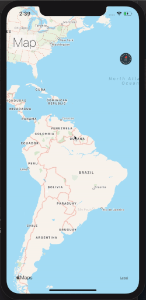
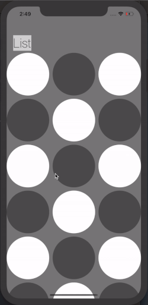
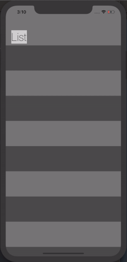

# AnythingInteresting

> A readme file for interesting things I discover while developing apps

## [TransparentUINavigationController](https://gist.github.com/MhndMousa/7af4898ab9fd449023c943bde38c0f98)

While experimenting with UINavigationController in Xcode, I discovered this transparent navigation bar effect. I'm a huge fan of minimalistic design and I'm so happy I came across this.

This effect looks exceptionally slick on UIScrollView inherited classes.

